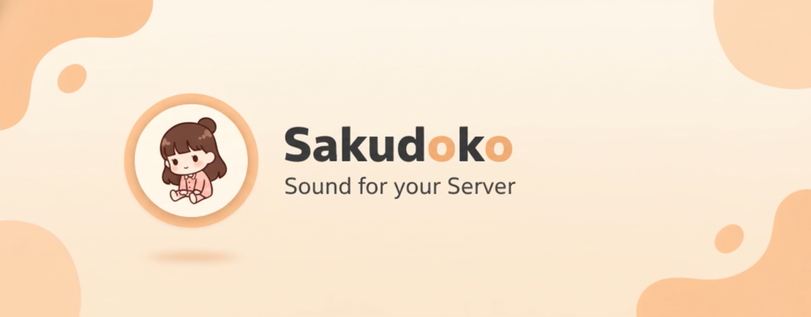

# Sakudoko Discord Music Bot
<div align="center">
  
  <br>
  <h1>Sakudoko Music Bot</h1>
</div>
## Features
- Play music from YouTube, SoundCloud, Spotify, etc.
- Advanced queue, playlist, and Music Room UI
- Permission system (owner/admin)
- Auto channel management
- Real-time embed updates
- Rate-limit & error notifications

## 🚀 Quick Start

```bash
# 1. Clone repository
git clone <repository-url>
cd sakudoko_bot

# 2. Install dependencies
pip install -r requirements.txt

# 3. Setup environment
cp .env.example .env
# แก้ไข .env และใส่ DISCORD_TOKEN ของคุณ

# 4. Run bot
python main.py
```

📖 **คู่มือเพิ่มเติม:**
- [การติดตั้งแบบละเอียด](docs/SETUP.md)
- [ฟีเจอร์ทั้งหมด](docs/FEATURES.md)
- [Deploy บน Azure](docs/DEPLOY_AZURE.md)
- [Deploy บน Railway](docs/DEPLOY_RAILWAY.md)

## 🌐 Web Dashboard

เมื่อรันบอทแล้ว เปิด Dashboard ได้ที่: **http://localhost:8080**

แสดง:
- สถานะบอท (Online/Offline)
- จำนวนเซิร์ฟเวอร์และผู้ใช้
- Uptime และ Latency
- Logs แบบ real-time

## 📦 Deploy

รองรับการ deploy หลายรูปแบบ:
- ✅ Docker & Docker Compose
- ✅ Azure Web App
- ✅ Railway
- ✅ VPS (Linux/Windows)
- ✅ Local Machine

ดู scripts ใน `scripts/` folder

## Author

**Sakudoko Team**

## เชิญบอท:
[Invite Bot](https://discord.com/oauth2/authorize?client_id=1438729107578814564&scope=bot+applications.commands&permissions=277025508352)


#### Contact
[]([https://discord.com/users/1208777602840400044]) | Iuooaie

## License
MIT
[1](https://ppl-ai-file-upload.s3.amazonaws.com/web/direct-files/attachments/104746957/70e6214e-92f0-4146-87d6-9158e2d36da2/README.md)
